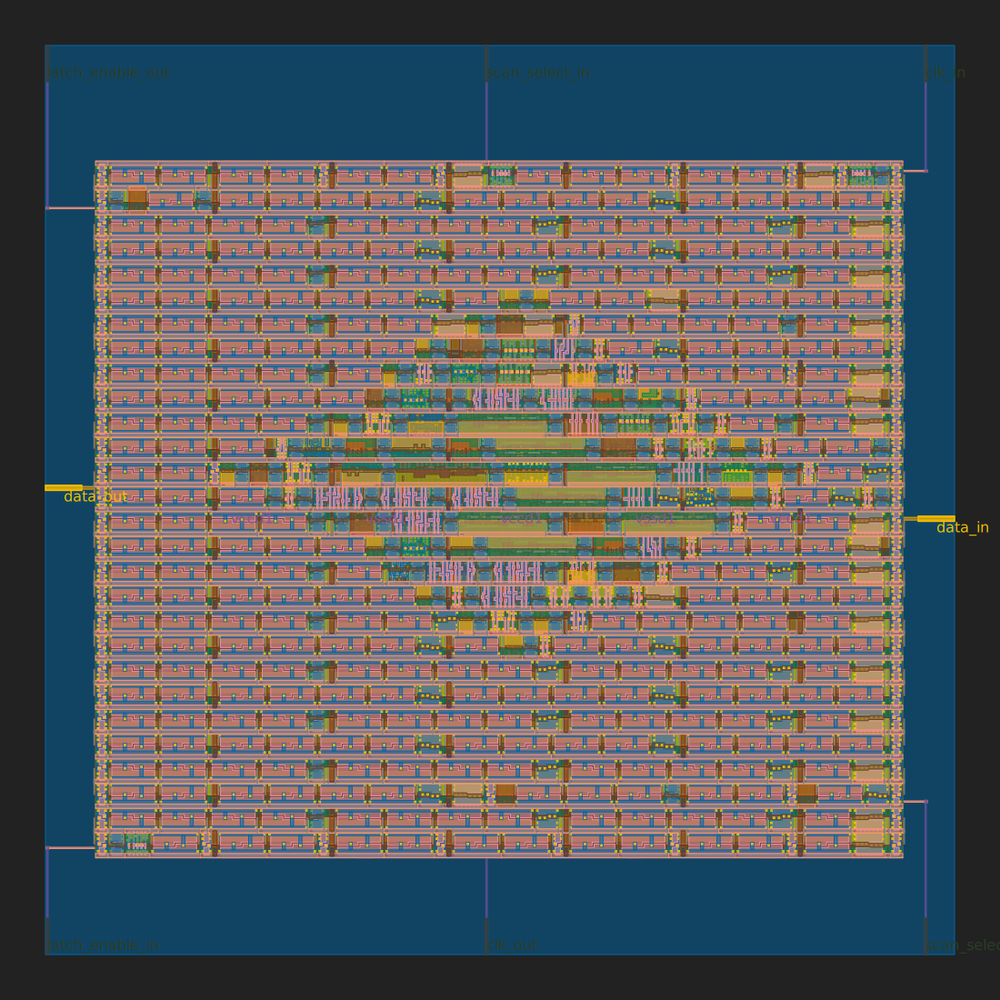

Unsigned 4x4 multiplier in comb logic for binary numbers based on: shift, fulladders, &\
Taken from my old project: https://github.com/splinedrive/my_multiplier/
[                                                                                                                

